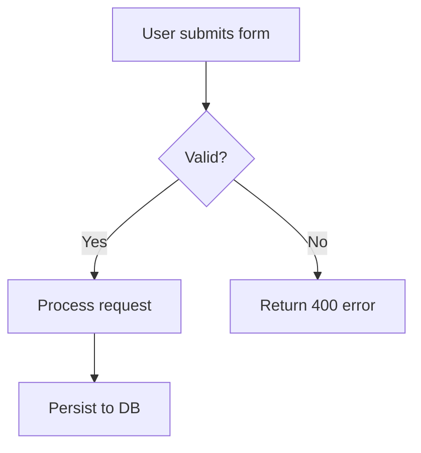
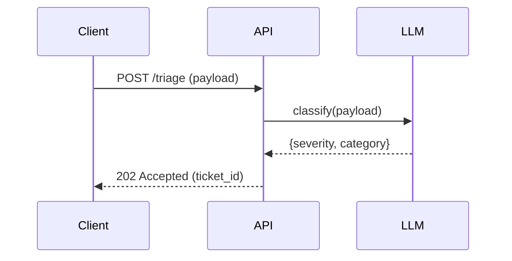
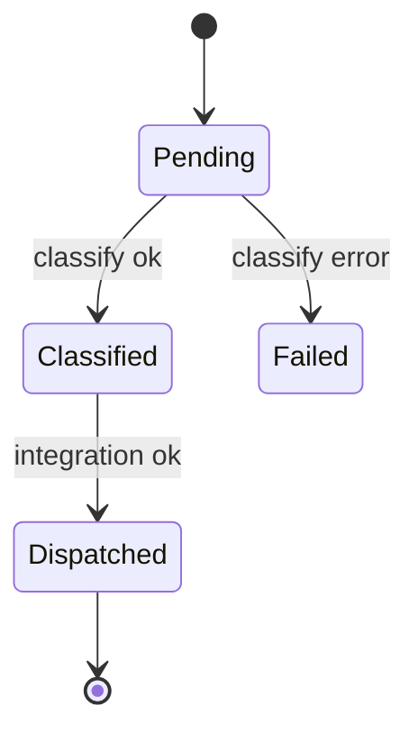
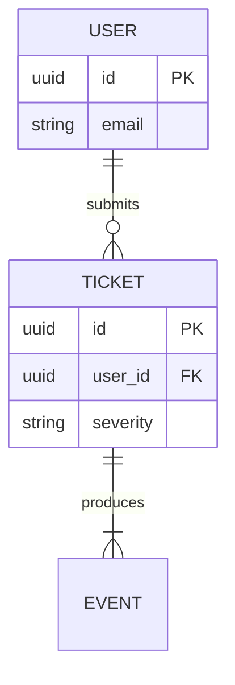

# Gabe Docs — Documentation Standards

The house style for every markdown file the gabe-lens suite creates or touches. Distilled from BMAD tech-writer standards + gabe-lens-specific conventions (analogy-first openers, per-well diagram recommendations).

## Three load-bearing rules

1. **CommonMark strict.** No Setext, no ambiguous indented code blocks, no mixed list markers.
2. **No time estimates.** Never write "30 min", "2-4 hours", "reading time: 5min" unless the user explicitly asks. Time varies per project/team; estimates rot.
3. **Analogy first, then the thing.** Every well doc opens with the quoted one-liner from `KNOWLEDGE.md`. Every architectural explanation leads with the mental model, then the mechanism.

## CommonMark essentials

- **Headers:** ATX only (`#`, `##`, `###`). Single space after `#`. No trailing `#`. Never skip levels.
- **Code blocks:** fenced with language tag (```python, ```sh, ```yaml). Never indented blocks.
- **Lists:** one marker style per list (`-` throughout, or `*`, or `+`). Blank line before/after.
- **Links:** inline `[text](url)` or reference style. No bare URLs without `<>`.
- **Emphasis:** `**bold**`, `*italic*`. Pick one style per doc, stay consistent.
- **Line breaks:** blank line between paragraphs. Single `\n` is ignored.
- **Frontmatter:** YAML, opening/closing `---`, only when the document type expects it.

## Mermaid diagrams: valid syntax required

Rules:

1. Always specify diagram type on first line inside the fence.
2. Use Mermaid v10+ syntax.
3. Keep focused: **5-10 nodes ideal, 15 maximum.** If you need more, split into multiple diagrams.
4. Label nodes with intent, not just names (`Classify[Cheap classifier]`, not `A`).

### Diagram type selection

| Diagram type | Best for | Use when |
|--------------|----------|----------|
| `flowchart` | Process flows, decision trees, data-flow overviews | Showing how data/control moves through a stage |
| `sequenceDiagram` | API interactions, message flows, request/response | Multiple actors exchanging messages over time |
| `stateDiagram-v2` | State machines, lifecycle stages, status transitions | An entity moves through discrete named states |
| `erDiagram` | Database schemas, entity relationships | Showing tables + FKs + cardinality |
| `classDiagram` | Object models, class hierarchies, interfaces | Typed system with inheritance or composition |
| `gitGraph` | Branch strategies, release flows | Explaining version-control conventions |

### Syntax templates

**Flowchart** (data/control flow):

````markdown

````

**Sequence** (interaction flow):

````markdown

````

**State** (lifecycle):

````markdown

````

**ER** (data model):

````markdown

````

## Per-well diagram recommendations

When scaffolding a well doc (`/gabe-teach init-wells` Step 2e), pick the diagram type whose question matches the well's dominant question. One diagram per well is usually enough. Add more only when the well genuinely covers multiple questions.

| Well type (by name/description) | Primary diagram | Question it answers |
|---------------------------------|-----------------|---------------------|
| Guardrails / Validation / Safety | `flowchart` | "What happens to a request as it flows through validation?" |
| LLM Pipeline / Orchestration / Agent | `flowchart` + `stateDiagram-v2` | "How does data flow?" + "What states does a run pass through?" |
| API Layer / HTTP / Endpoints | `sequenceDiagram` | "Who talks to whom, in what order?" |
| Data Model / Schema / Persistence | `erDiagram` | "What entities exist and how are they related?" |
| Integrations / Adapters / Outbound | `sequenceDiagram` | "What calls go to the external service and when?" |
| Frontend / UI / Client | `flowchart` | "How does a user navigate from X to Y?" |
| Observability / Monitoring / Metrics | `flowchart` | "How does a signal flow from code to dashboard?" |
| Other / Uncategorized | `flowchart` (default) | Generic process flow |

Matching heuristic (case-insensitive substring match on the well name or description):

- `api`, `http`, `endpoint`, `route` → sequenceDiagram
- `data`, `schema`, `model`, `db`, `persistence`, `migration` → erDiagram
- `state`, `lifecycle`, `pipeline`, `orchestration` → stateDiagram-v2 (or flowchart if pipeline has branches)
- `integration`, `adapter`, `webhook`, `client`, `outbound` → sequenceDiagram
- default → flowchart

## Analogy-first opener convention (gabe-lens specific)

Every well doc opens with three lines, in this exact order:

```markdown
# [Well Name] — [Analogy in quotes]

> [Description sentence from KNOWLEDGE.md]

**Paths:** [Paths globs from KNOWLEDGE.md]
```

The analogy is NOT a tagline — it's the mental-model anchor the reader uses to orient themselves before reading mechanism. Keep it in double quotes exactly as stored in `KNOWLEDGE.md` (5-15 words, from `gabe-lens` oneliner mode).

When a reader skims the doc, they should leave with the analogy in their head even if they read nothing else. Everything below is detail in service of the analogy.

## Well doc template

This is the template scaffolded by `/gabe-teach init-wells` Step 2e and `/gabe-teach wells → [docs N]`:

```markdown
# [Well Name] — "[analogy]"

> [description]

**Paths:** [paths]

<!-- Standards: see ~/.claude/skills/gabe-docs/SKILL.md -->

---

## Purpose

<!-- 2-3 sentences: what this section of the application does and why it exists. -->
<!-- Populated manually by the human, or auto-appended from verified /gabe-teach topics. -->

## Key Decisions

<!-- Load-bearing choices for this well. Each entry: date + one-line title + 1-2 paragraph rationale. -->
<!-- Example:
### 2026-04-15 — Guardrails run before the LLM, not after
Reasoning: ...
-->

## Key Diagrams

<!-- Pick diagram type based on well dominant question. See gabe-docs SKILL.md per-well table. -->
<!-- Suggested for this well: [DIAGRAM_TYPE] -->
<!-- Replace placeholder with real diagram once the flow stabilizes. -->

```mermaid
[PLACEHOLDER_DIAGRAM]
```

## Topics (auto-appended)

<!-- /gabe-teach topics appends verified topic summaries here on first run. -->
<!-- Do not edit the structure below this line; edit individual entries freely. -->
```

The scaffolder substitutes `[DIAGRAM_TYPE]` (from the per-well recommendation table) and `[PLACEHOLDER_DIAGRAM]` (a minimal valid skeleton of that type — e.g., `flowchart TD\n    A[Start] --> B[TODO]`). The placeholder is intentionally crude so a human replaces it; do NOT over-invest in auto-generated diagrams.

## Writing rules (gabe-generated docs)

- **Active voice, present tense.** "The classifier routes by severity" not "The classifier will route by severity".
- **Second person.** "You can override" not "Users can override".
- **Task-oriented.** Every section answers a "how do I…" or "why did we…" question, not "what does this class do".
- **One idea per sentence.** Split compound sentences.
- **Examples after explanations.** Rationale first, snippet second.
- **Accessibility.** Descriptive link text (not "click here"), alt text for diagrams (describe what the diagram shows in one sentence before the fence).

## Quality checklist (for auto-append and handwritten additions)

- [ ] CommonMark compliant (no violations)
- [ ] No time estimates
- [ ] Headers in proper hierarchy
- [ ] Code blocks have language tags
- [ ] Links have descriptive text
- [ ] Mermaid diagrams use type from the recommendation table (or document why an alternative was chosen)
- [ ] Diagrams are ≤15 nodes
- [ ] Active voice, present tense, second person
- [ ] Analogy-first opener preserved (never delete the `# Title — "analogy"` line)

## When in doubt

Precedence:

1. Project-specific standards in `.kdbp/` (if present — rare)
2. This skill (`gabe-docs`)
3. CommonMark spec

Do not invent new conventions without updating this skill file.
