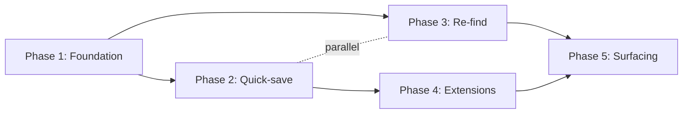

# ROADMAP — bookmark-manager

> **This is the phase plan.** Phase additions, splits, and reorderings flow through `/gabe-scope-change`.

## 1. Granularity

- **Chosen:** standard (5 phases, sprint-sized)
- **Alternatives considered:** coarse (3 phases), fine (8 phases)

## 2. Phase Table (at a glance)

| ID | Name | Status | Depends-on | Parallel-with | Covers REQs |
|---|---|---|---|---|---|
| 1 | Foundation + storage | pending | — | — | — |
| 2 | Clipboard quick-save | pending | 1 | — | [REQ-01](SCOPE.md#req-01) |
| 3 | Semantic re-find | pending | 1 | 2 | [REQ-02](SCOPE.md#req-02) |
| 4 | Browser extensions | pending | 2 | — | — |
| 5 | Ambient surfacing | pending | 3, 4 | — | [REQ-03](SCOPE.md#req-03) |

## 3. Phase Detail

### Phase 1 — Foundation + storage {#phase-1}

**Status:** pending
**Goal:** By end of this phase, the Tauri app boots with an empty SQLite database, ready to accept bookmark CRUD via an internal API.

**Why (business intent):** Every downstream phase needs local storage. Without a working SQLite layer + app shell, nothing else can be tested end-to-end. This phase exists to de-risk the infrastructure assumption (Tauri + SQLite on macOS + Linux) before any user-facing features are built.

**Covers REQs:** —
**Depends-on:** —
**Parallel-with:** —

**Exit criteria:**
- App builds and runs on macOS + Linux
- SQLite schema migrations run clean
- Internal CRUD API has ≥80% test coverage

---

### Phase 2 — Clipboard quick-save {#phase-2}

**Status:** pending
**Goal:** By end of this phase, a user can press a global hotkey and save a URL with one-line context in under 3 seconds.

**Why (business intent):** This is the gravitational center of the product — if saving isn't faster than a browser bookmark, no user ever adopts the workflow. The rest of the roadmap leans on this habit being cheap.

**Covers REQs:** [REQ-01](SCOPE.md#req-01)
**Depends-on:** 1
**Parallel-with:** —

**Exit criteria:**
- REQ-01 acceptance signal: p95 ≤ 3s across 10 saves
- Global hotkey works on macOS + Linux
- Tauri system tray shows last-saved

---

### Phase 3 — Semantic re-find {#phase-3}

**Status:** pending
**Goal:** By end of this phase, a user can type an approximate topic and retrieve matching bookmarks without exact-string matches.

**Why (business intent):** The promise of the product is "I don't have to remember it." Without semantic retrieval, the product degrades to a faster browser bookmark, which is not worth switching for. This phase crosses the value threshold.

**Covers REQs:** [REQ-02](SCOPE.md#req-02)
**Depends-on:** 1
**Parallel-with:** 2

**Exit criteria:**
- REQ-02 acceptance signal: re-find under 30s for a 60+-day-old bookmark
- Local embedding model runs under 500ms per query
- Search UI renders results incrementally

---

### Phase 4 — Browser extensions {#phase-4}

**Status:** pending
**Goal:** Chrome + Firefox extensions can save the active tab to the local app via native messaging.

**Why (business intent):** Clipboard is the MVP save path, but real user habit is "right-click → save." Extensions close that gap and are required before inviting anyone else to try the app.

**Covers REQs:** —
**Depends-on:** 2
**Parallel-with:** —

**Exit criteria:**
- Both extensions submit saves that land in SQLite
- Extensions handle permission prompts gracefully

---

### Phase 5 — Ambient surfacing {#phase-5}

**Status:** pending
**Goal:** On app open, 3–5 bookmarks are surfaced that the user is likely to find useful now, based on recent browsing + calendar context.

**Why (business intent):** The vision (north star) lives here. Without ambient surfacing the product is a well-built storage tool; with it, the product is a memory prosthetic. Shipping this last lets us validate saving + re-find first, so the surfacing layer has real data to reason over.

**Covers REQs:** [REQ-03](SCOPE.md#req-03)
**Depends-on:** 3, 4
**Parallel-with:** —

**Exit criteria:**
- REQ-03 acceptance signal: ≥1 surprise-useful surfacing per week for 4 weeks
- Feature flag allows disable
- No personal data leaves the device

---

## 4. Dependency Graph

## 5. Coverage Matrix

| REQ | Phase |
|---|---|
| [REQ-01](SCOPE.md#req-01) | [Phase 2](#phase-2) |
| [REQ-02](SCOPE.md#req-02) | [Phase 3](#phase-3) |
| [REQ-03](SCOPE.md#req-03) | [Phase 5](#phase-5) |

## 6. Roadmap Change Log

| Date | Event | Summary |
|---|---|---|
| 2026-04-21 | init | Initial roadmap derived from SCOPE.md v1. Granularity: standard (5 phases). |
