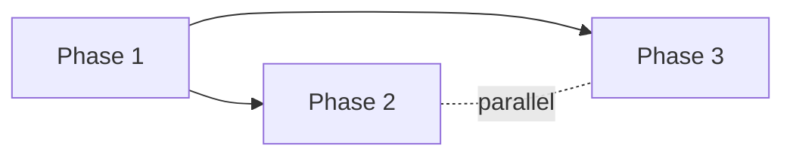

# ROADMAP — <project name>

> **This is the phase plan.** Phase additions, splits, and reorderings flow through `/gabe-scope-change`. Direct edits flagged by `/gabe-commit` audit.

## 1. Granularity

- **Chosen:** standard (5–8 phases, sprint-sized)
- **Alternatives considered:** coarse (3–5, milestone-sized), fine (8–12, iteration-sized), custom

## 2. Phase Table (at a glance)

| ID | Name | Status | Depends-on | Parallel-with | Covers REQs |
|---|---|---|---|---|---|
| 1 | <phase name> | pending | — | — | [REQ-01](SCOPE.md#req-01) |
| 2 | <phase name> | pending | 1 | — | [REQ-02](SCOPE.md#req-02) |
| 3 | <phase name> | pending | 1 | 2 | [REQ-03](SCOPE.md#req-03) |

### Status vocabulary
- **pending** — not started
- **in-progress** — at least one task checked off in per-phase PLAN.md
- **blocked** — dependency or external blocker
- **complete** — all Covers REQs satisfied; validated by `/gabe-align`
- **deferred** — moved out of current roadmap (retained for audit)

### ID conventions
- **Integer IDs** (1, 2, 3, …) are root phases from the initial roadmap.
- **Decimal IDs** (1.1, 2.3, …) are `/gabe-scope-addition` insertions between root phases.

## 3. Phase Detail

Each phase below is deep-linkable via `{#phase-N}` anchor. `/gabe-teach` SCOPE mode surfaces these on demand.

### Phase 1 — <name> {#phase-1}

**Status:** pending
**Goal:** <goal-backward observable user truth — "By end of this phase, a user can observe X">

**Why (business intent):** <one paragraph explaining why this phase exists now in the roadmap; what would be broken or impossible without it. Read by `/gabe-teach` SCOPE mode.>

**Covers REQs:** [REQ-01](SCOPE.md#req-01)
**Depends-on:** —
**Parallel-with:** —

**Exit criteria:**
- REQ-01 acceptance signal satisfied
- `/gabe-align` drift check passes
- `/gabe-review` has zero blocking items

---

### Phase 2 — <name> {#phase-2}

**Status:** pending
**Goal:** <goal statement>

**Why (business intent):** <paragraph>

**Covers REQs:** [REQ-02](SCOPE.md#req-02)
**Depends-on:** 1
**Parallel-with:** —

**Exit criteria:**
- REQ-02 acceptance signal satisfied
- <phase-specific criterion>

---

<!-- Add phase detail sections as needed. Each must have a unique Phase-N ID + {#phase-N} anchor. -->

## 4. Dependency Graph

<!-- Auto-generated from Depends-on and Parallel-with columns. Regenerated on any `/gabe-scope-change`. -->

## 5. Coverage Matrix

Every REQ from [SCOPE.md](SCOPE.md#requirements) appears in exactly one phase below. Orphans and duplicates block `/gabe-scope` finalize.

| REQ | Phase |
|---|---|
| [REQ-01](SCOPE.md#req-01) | [Phase 1](#phase-1) |
| [REQ-02](SCOPE.md#req-02) | [Phase 2](#phase-2) |
| [REQ-03](SCOPE.md#req-03) | [Phase 3](#phase-3) |

## 6. Roadmap Change Log

Append-only. Tracks phase splits, merges, insertions, reorderings, and the `/gabe-scope-change` event that caused each.

| Date | Event | Summary |
|---|---|---|
| <YYYY-MM-DD> | init | Initial roadmap derived from SCOPE.md v1. Granularity: standard. |
